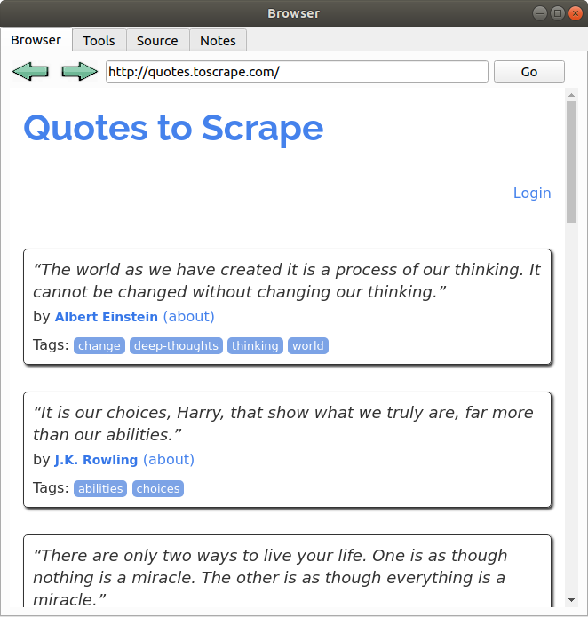
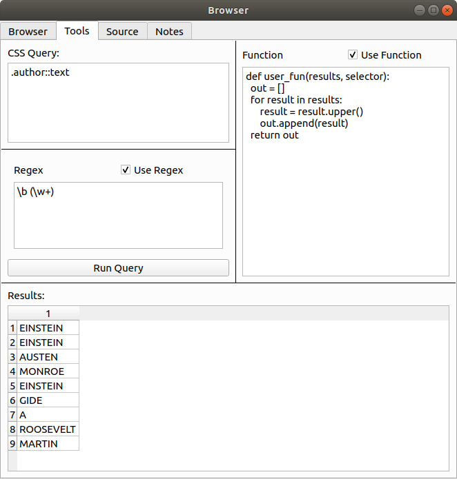
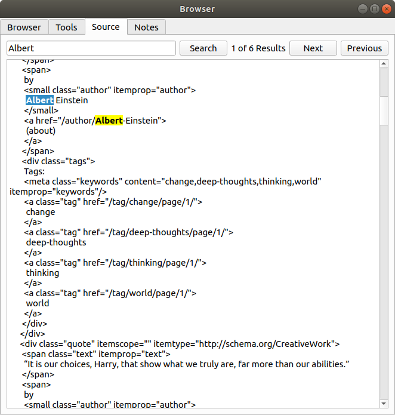

# Scraping Browser
A simple, Qt-Webengine powered web browser with built in functionality for basic scrapy webscraping support.

# Instructions
## Browser Tab
Enter any url into search bar and hit return or press the Go button. When the loading animation finishes it will be ready to parse in the Tools tab.

## Tools Tab
The tools tab contains various sections for parsing content of the page. The purpose of this tab is to make it easy to test queries and code for use in a scrapy spider.
> **NOTE:** This will use the **initial** html response. If additional requests, javascript, etc alter the page later this will not be taken into account.

It will load the initial html with an additional request using the `requests` package. When running a query it will create a selector object using `Selection` from the parsel package.

### Query Box
The query box lets you use [parsel](https://github.com/scrapy/parsel) compatible CSS queries to extract data from the page.

It returns results as though `selection.css('YOUR QUERY').getall()` was called.

If there are no results or there is an error in the query a dialogue will pop up informing you of the issue.

### Regex Box
This box lets you add a regular expression pattern to be used in addition to the previous css query. 

It returns results as though `selection.css('YOUR QUERY').re(r'YOUR REGEX')'` was called. This means that if you use groups it will only return the content within parenthesis.

### Function Box
This box lets you define additional python code that can run on the results of your query and regex. The code can be as long and complex as you want, including adding additional functions, classes, imports etc.

The only requirement is you must include a function called `user_fun(results, selector)` that returns a `list`. 

### Results Box

This table will list all the results, passed through the regex and function if defined.

## Source Tab

This tab contains the html source that is used in the Tools tab. You can use the text box to search for specific content. All searches are not case sensitive.

## Notes Tab

This is just a plain text box. Content in here is not saved when you exit the app.

# Integration with Scrapy Shell

It is possible to integrate this tool with the scrapy shell. This will allow you to use it on responses that have been passed through your middlewares, access more complex requests and more specific selectors.

# Installation

The quickest way to integrate it is to follow these steps:

1. Copy the `utils_ui` folder into your project directory.  
2. Install the requirements in `requirements-shell.txt`

# Activation

To use it in your shell:

1. Import it into your shell with `from YOUR_PROJECT_DIRECTORY.utils_ui import scrapy_tools`
2. Use the `scrapy_tools.load_selector` function to open a window with a selector loaded in.

> For example `scrapy_tools.load_selector(response)` will load your response into the UI.

When you run the code a window named `Shell UI` will open that contains the `Tools`, `Source` and `Notes` tabs from the standalone window mentioned above.
